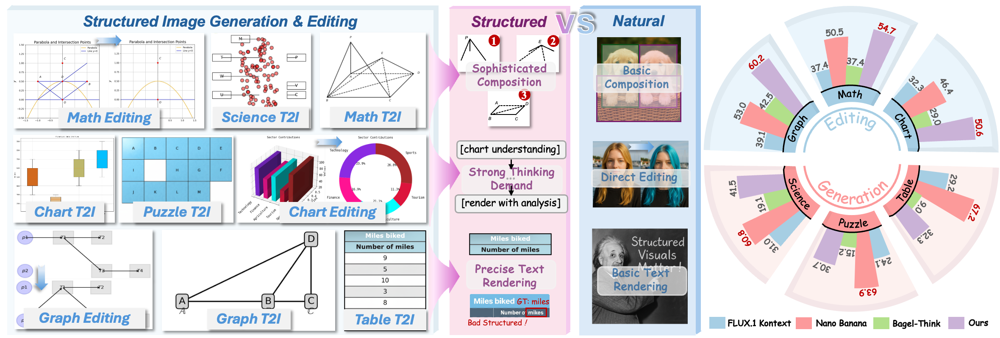

<h1 align="center">
  
  Factuality Matters: When Image Generation and Editing Meet Structured Visuals
</h1>

<div align="center">

<p><em>Dataset, benchmark, and model for structured images generation and editing</em></p>

[](https://huggingface.co/papers/2507.15846)
[](https://arxiv.org/pdf/2510.05091)
[](https://structvisuals.github.io/)
<a href="https://huggingface.co/datasets/hshjerry0315/StructEditBench"></a>
<a href="https://huggingface.co/datasets/hshjerry0315/StructT2IBench"></a>

</div>

<!-- --- -->

<div align="center">
  
  <!-- <p><em>StructBench evaluates generation and editing of charts, diagrams, math figures, and more structured visuals.</em></p> -->
</div>


## Overview

StructBench evaluates image generation and editing models on structured visuals like charts, diagrams, math figures, tables, graphs, and puzzles:

- **StructEditBench**: 1,714 editing examples with 32,031 Q&A pairs → [hshjerry0315/StructEditBench](https://huggingface.co/datasets/hshjerry0315/StructEditBench)
- **StructT2IBench**: 1,714 T2I examples with 37,941 Q&A pairs → [hshjerry0315/StructT2IBench](https://huggingface.co/datasets/hshjerry0315/StructT2IBench)
- **StructScore**: Multi-round Q&A evaluation metric using VLMs (GPT-5 or Qwen2.5-VL-72B)

Categories: **Math**, **Graph**, **Chart**, **Puzzle**, **Science**, **Table**

## Installation

We recommend using a Python 3.10+ virtual environment:

```bash
conda create -n structbench python=3.10
conda activate structbench
```

Install dependencies:

```bash
# For GPT-5 evaluation
pip install openai datasets Pillow tqdm huggingface_hub

# For Qwen evaluation (with vLLM acceleration)
pip install vllm transformers
```

## Dataset Format

Your evaluation dataset should be hosted on Hugging Face Hub with the following structure:

**Required columns:**
- `qa_list`: List of Q&A dictionaries, each containing:
  - `question` (str): The question to ask about the image
  - `answer` or `ground_truth_answer` (str): The correct answer
  - `label` (str): Either `"editing"` (modified regions) or `"maintain"` (unchanged regions)
- `category` (str): Category label (e.g., "chart", "math", "table", "graph", "puzzle", "science")
- `{prefix}{model_name}` (PIL.Image): Your model's generated images

**Example dataset structure:**
```python
{
    "qa_list": [
        {
            "question": "What is the title of the chart?",
            "answer": "Sales Report",
            "label": "editing"
        },
        {
            "question": "What is the background color?",
            "answer": "white",
            "label": "maintain"
        }
    ],
    "category": "chart",
    "output_image_mymodel": <PIL.Image>,  # Your model's output
    # Optional for context:
    "source_image": <PIL.Image>  # Original image for editing tasks
}
```

**Note:** The `label` field determines how accuracy is weighted:
- Final accuracy = 0.9 × editing_accuracy + 0.1 × maintain_accuracy

## Quick Start

### Step 1: Load Benchmark Dataset

```python
from datasets import load_dataset

# Load official benchmark
dataset = load_dataset("hshjerry0315/StructEditBench")
# or
dataset = load_dataset("hshjerry0315/StructT2IBench")
```

### Step 2: Add Your Model's Outputs

```python
from PIL import Image
from datasets import Dataset

def add_model_outputs(dataset, model_fn, prefix="output_image_mymodel"):
    """Add your model's generated images to the dataset."""
    results = []
    for item in dataset:
        # Generate image with your model
        generated_image = model_fn(item)  # Returns PIL.Image
        
        # Add to item
        item[prefix] = generated_image
        results.append(item)
    
    return Dataset.from_list(results)

# Add your model outputs
dataset_with_outputs = add_model_outputs(dataset["train"], your_model_function)

# Push to HuggingFace for evaluation
dataset_with_outputs.push_to_hub("your-username/your-eval-dataset")
```

### Step 3: Run Evaluation

```bash
# Evaluate with Qwen2.5-VL
python qwen_scoring.py \
    --model_path Qwen/Qwen2.5-VL-72B-Instruct \
    --dataset_path your-username/your-eval-dataset \
    --output_dir results/mymodel \
    --tensor_parallel_size 8 \
    --prefix output_image_
```

## Usage

### GPT-5 Evaluation

```bash
export OPENAI_API_KEY="your-api-key-here"

python gpt_scoring.py \
    --dataset_path hshjerry0315/StructEditBench \
    --output_dir results/gpt_eval \
    --api_key $OPENAI_API_KEY \
    --num_workers 100 \
    --prefix output_image_
```

**Arguments:**

| Argument | Type | Required | Default | Description |
|----------|------|----------|---------|-------------|
| `--dataset_path` | str | ✓ | - | HuggingFace dataset path (e.g., hshjerry0315/StructEditBench) |
| `--output_dir` | str | ✓ | - | Output directory for results |
| `--api_key` | str | ✓ | - | OpenAI API key |
| `--num_workers` | int | | 100 | Number of parallel threads |
| `--prefix` | str | | `output_image_` | Prefix for model image columns (e.g., `output_image_mymodel`) |
| `--split` | str | | `train` | Dataset split to evaluate |
| `--debug` | flag | | False | Process only 20 samples for testing |
| `--output_repo_name` | str | | None | Optional: Upload results to HuggingFace Hub |

### Qwen2.5-VL Evaluation

```bash
python qwen_scoring.py \
    --model_path Qwen/Qwen2.5-VL-72B-Instruct \
    --dataset_path hshjerry0315/StructEditBench \
    --output_dir results/qwen_eval \
    --tensor_parallel_size 8 \
    --dtype bfloat16 \
    --gpu_mem_util 0.9
```

**Arguments:**

| Argument | Type | Required | Default | Description |
|----------|------|----------|---------|-------------|
| `--dataset_path` | str | ✓ | - | HuggingFace dataset path (e.g., hshjerry0315/StructT2IBench) |
| `--output_dir` | str | ✓ | - | Output directory for results |
| `--model_path` | str | ✓ | - | Qwen model path or HF repo |
| `--tensor_parallel_size` | int | | 4 | Number of GPUs for tensor parallelism |
| `--dtype` | str | | `bfloat16` | Model dtype (bfloat16 or float16) |
| `--gpu_mem_util` | float | | 0.9 | GPU memory utilization (0-1) |
| `--max_model_len` | int | | 5120 | Maximum model sequence length |
| `--max_new_tokens` | int | | 256 | Max tokens to generate per response |
| `--img_size` | int | | 1024 | Image preprocessing size (512 or 1024) |
| `--prefix` | str | | `output_image_` | Prefix for model image columns (e.g., `output_image_mymodel`) |
| `--split` | str | | `train` | Dataset split to evaluate |
| `--debug` | flag | | False | Process only 20 samples for testing |
| `--output_repo_name` | str | | None | Optional: Upload results to HuggingFace Hub |

## Output Format

After evaluation, results are saved in `output_dir/`:

```
results/
├── processed_dataset/                          # Full dataset with results
├── StructEditBench_mymodel_analysis.json       # Summary for GPT eval
└── StructEditBench_mymodel_qwen_analysis.json  # Summary for Qwen eval
```

### Processed Dataset

The evaluated dataset contains your original data plus new columns for each model:

**GPT-5 output columns:**
- `{model_name}_list`: List of Q&A results with answers, corrections, and labels
- `{model_name}_accuracy`: Weighted accuracy (0.9 × editing + 0.1 × maintain)
- `{model_name}_editing_accuracy`: Accuracy on editing questions
- `{model_name}_maintain_accuracy`: Accuracy on maintain questions

**Qwen output columns:**
- `{model_name}_qwen_list`: List of Q&A results
- `{model_name}_qwen_accuracy`: Weighted accuracy
- `{model_name}_qwen_editing_accuracy`: Accuracy on editing questions
- `{model_name}_qwen_maintain_accuracy`: Accuracy on maintain questions

### Analysis JSON

```json
{
    "model_name": "mymodel",
    "global_weighted_accuracy": 45.23,
    "global_editing_accuracy": 48.50,
    "global_maintain_accuracy": 42.15,
    "group_accuracies": {
        "chart": {
            "accuracy": 50.58,
            "editing_accuracy": 52.30,
            "maintain_accuracy": 48.90,
            "num_samples": 285
        },
        "math": {...},
        ...
    },
    "total_samples": 1714,
    "total_evaluations": 32031
}
```

## Leaderboard Submission

To submit your results to the StructBench leaderboard:

**Required Metrics:**
- **StructEditBench**: 
  - Accuracy (%) for each category (Math, Chart, Graph, Puzzle, Science, Table)
  - Overall Accuracy (%)
  - PSNR for each category and overall
- **StructT2IBench**: 
  - Accuracy (%) for each category (Math, Chart, Graph, Puzzle, Science, Table)
  - Overall Accuracy (%)

**Submission:**
Email your `*_analysis.json` files and model details to:
- [zhuole1025@gmail.com](mailto:zhuole1025@gmail.com)
- [hshjerry@buaa.edu.cn](mailto:hshjerry@buaa.edu.cn)

## Citation

If you use StructBench in your research, please cite:

```bibtex
@article{zhuo2025structbench,
  title={Factuality Matters: Image Generation and Editing Meet Structured Visuals},
  author={Zhuo, Le and Han, Songhao and Pu, Yuandong and Qiu, Boxiang and Paul, Sayak and Liao, Yue and Liu, Yihao and Shao, Jie and Chen, Xi and Liu, Si and Li, Hongsheng},
  journal={arXiv preprint arXiv:2510.05091},
  year={2025}
}
```

## License

This project is released under the Apache License 2.0.
